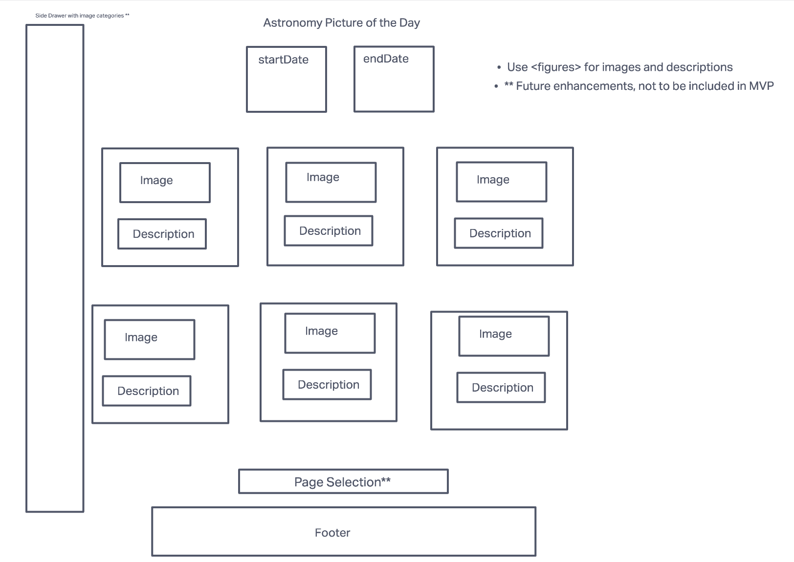

# Astro Pic of The Day Search Application

 - Application to search the archive of the Astro Pics of the Day between a specified date range. 

# User Stories

- As a user I want to be able to choose a month and a year and see all of the photos that were posted during that month.

# Technologies Used

- HTML
- CSS
- Javascript ES6
- NASA Astronomy Picture of the Day API
- Boostrap

# Screenshots

# Getting Started
- [Click here](https://main--apotd-archive.netlify.app/) to visit the Astronomy Picture of the Day Archive.
# Future Enhancements
 - hide API key
 
 
 